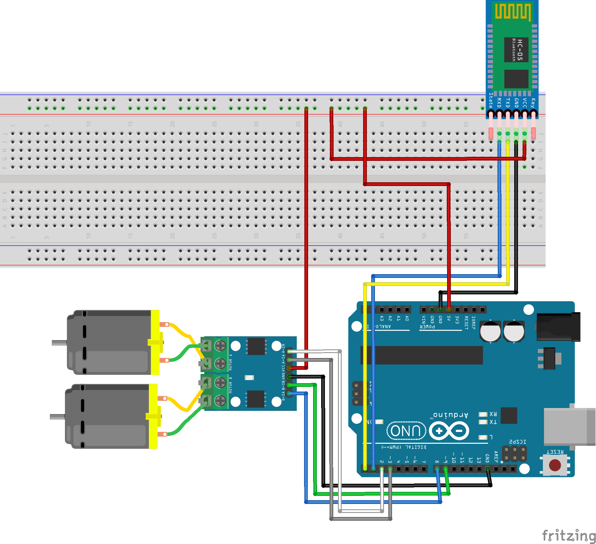

# Arduino_bluetooth_RC_car
## Description
*under construction*
## Steps
### 1) build the hardware
| components | qty |
|----|:---:|
| arduino uno | 1 |
| breadboard | 1 |
| jumper wires | 11+ |
| HC-06 bluetooth module | 1 |
| L9110 h-bridge | 1 |
| DC motor | 2 |
| wheel | 2 |
| 5V output power bank | 1 |

### 2) upload `bluetooth_car.ino` file to Arduino
by using [Arduino IDE](https://www.arduino.cc/en/software)
### 3) set up mobile app
Three ways are provided:
1. (recommended) import `bluetooth_car_v1.aia` file to MIT app inventor and connect your smartphone with MIT AI2 Companion app ([Google Play](https://play.google.com/store/apps/details?id=edu.mit.appinventor.aicompanion3&hl=en&gl=US)/[App Store](https://apps.apple.com/us/app/mit-app-inventor/id1422709355))
2. **if you want to configure the app**, load the app [Arduino_bluetooth_car_controller](https://gallery.appinventor.mit.edu/?galleryid=5190c66e-bd55-44f2-b813-85d0b7f644bd) into MIT app inventor and connect your smartphone with MIT AI2 Companion app ([Google Play](https://play.google.com/store/apps/details?id=edu.mit.appinventor.aicompanion3&hl=en&gl=US)/[App Store](https://apps.apple.com/us/app/mit-app-inventor/id1422709355))
3. download `bluetooth_car_v1.apk` file to your Android device
